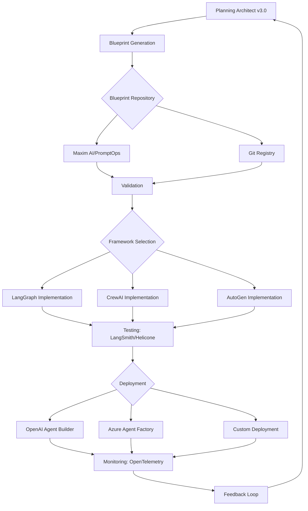

# Planning Architect - 2025 Technology Stack & Tools

**Version:** 1.0  
**Date:** October 15, 2025  
**Total Tools Identified:** 38  
**Categories:** 6

---

## Tool Categories Overview

| Category | Tool Count | Primary Purpose |
|----------|------------|-----------------|
| **Blueprint Management & Versioning** | 8 | Architectural blueprint registry, versioning, CI/CD integration |
| **State Schema & Data Modeling** | 7 | Automated schema generation, validation, type safety |
| **Multi-Agent Orchestration** | 9 | Framework integration, agent coordination, runtime management |
| **Visual Planning & Collaboration** | 6 | UI-based blueprint design, collaborative planning |
| **Testing & Quality Assurance** | 5 | Blueprint validation, regression testing, edge case analysis |
| **Monitoring & Observability** | 3 | Runtime tracing, debugging, performance monitoring |

**Total: 38 Tools**

---

## Category 1: Blueprint Management & Versioning (8 Tools)

### 1.1 Maxim AI
**Purpose:** Versioned architectural blueprint registries with collaborative editing  
**Key Capabilities:**
- Blueprint versioning and rollback
- Collaborative blueprint editing
- CI/CD integration for automated deployments
- Architectural change tracking

**Integration Points:**
- Export blueprints from Planning Architect
- Version control integration
- Automated blueprint validation

**Use Case:** Maintain architectural blueprint history, enable team collaboration, rollback failed designs

---

### 1.2 PromptOps
**Purpose:** Prompt and blueprint lifecycle management with deployment automation  
**Key Capabilities:**
- Source control tied blueprints
- Automated blueprint deployments
- Prompt/blueprint regression testing
- Multi-environment blueprint management

**Integration Points:**
- Blueprint-as-code workflows
- CI/CD pipeline integration
- Automated testing frameworks

**Use Case:** Treat architectural blueprints as versioned artifacts with automated testing and deployment

---

### 1.3 LangSmith
**Purpose:** Traceability and stepwise evaluation for LangChain/LangGraph blueprints  
**Key Capabilities:**
- Stepwise blueprint trace and debug
- LangGraph workflow visualization
- Performance profiling
- Blueprint regression testing

**Integration Points:**
- LangGraph StateGraph blueprints
- ReAct and Supervisor patterns
- Multi-agent coordination flows

**Use Case:** Debug complex LangGraph architectures, trace execution paths, identify bottlenecks

---

### 1.4 Git-based Blueprint Registry
**Purpose:** Version control for architectural blueprints  
**Key Capabilities:**
- Git-native blueprint storage
- Branch-based design exploration
- Merge request reviews for architecture changes
- Blueprint diff visualization

**Integration Points:**
- GitHub/GitLab repositories
- Pull request workflows
- Code review integration

**Use Case:** Store blueprints alongside code, enable architecture reviews through PRs

---

### 1.5 OpenPrompt
**Purpose:** Collaborative prompt and blueprint management platform  
**Key Capabilities:**
- Centralized blueprint repository
- Team collaboration features
- Blueprint sharing and templates
- Version comparison tools

**Integration Points:**
- Export blueprints to standard formats
- Import from various design tools
- API for programmatic access

**Use Case:** Share architectural patterns across teams, maintain organizational blueprint library

---

### 1.6 Blueprint Validation Engine (Custom)
**Purpose:** Automated blueprint completeness and correctness validation  
**Key Capabilities:**
- Schema completeness checks
- Component dependency validation
- Pattern conformance verification
- Security requirement validation

**Integration Points:**
- Planning Architect AutomatedEvaluationEngine
- CI/CD pipelines
- Pre-deployment validation

**Use Case:** Ensure blueprints meet quality standards before implementation

---

### 1.7 Architecture Decision Records (ADR) Tools
**Purpose:** Document architectural decisions within blueprints  
**Key Capabilities:**
- ADR generation and tracking
- Decision rationale documentation
- Impact analysis
- Historical decision reference

**Integration Points:**
- Blueprint metadata
- Documentation systems
- Knowledge management platforms

**Use Case:** Maintain context for architectural decisions, enable future refactoring

---

### 1.8 Blueprint Template Library
**Purpose:** Reusable architectural pattern templates  
**Key Capabilities:**
- Pattern catalog (ReAct, Supervisor, Hierarchical)
- Framework-specific templates
- Customizable templates
- Best practice patterns

**Integration Points:**
- Planning Architect pattern mapping
- HierarchicalMemorySystem
- Pattern performance database

**Use Case:** Accelerate blueprint generation with proven patterns

---

## Category 2: State Schema & Data Modeling (7 Tools)

### 2.1 DBSchema
**Purpose:** Visual database schema design and validation  
**Key Capabilities:**
- Visual schema modeling
- Schema documentation generation
- Schema validation and migration
- Multi-database support

**Integration Points:**
- Agent state schema design
- Database persistence layer
- State transition modeling

**Use Case:** Design complex agent state schemas visually, ensure data integrity

---

### 2.2 Pydantic
**Purpose:** Python data validation and type enforcement  
**Key Capabilities:**
- Runtime type validation
- Data serialization/deserialization
- Schema generation from types
- Validation error reporting

**Integration Points:**
- StateGraph state definitions
- API request/response validation
- Tool input/output validation

**Use Case:** Ensure type safety in agent state schemas, prevent runtime errors

---

### 2.3 TypedDict (Python)
**Purpose:** Type hints for dictionary-based state structures  
**Key Capabilities:**
- Static type checking
- IDE autocomplete support
- Documentation generation
- Type safety without runtime overhead

**Integration Points:**
- LangGraph StateGraph definitions
- State schema blueprints
- Component interface definitions

**Use Case:** Define strongly-typed agent states for LangGraph applications

---

### 2.4 JSON Schema Validator
**Purpose:** JSON-based schema validation and documentation  
**Key Capabilities:**
- Schema validation
- Documentation generation
- API contract validation
- Cross-language schema sharing

**Integration Points:**
- REST API definitions
- Configuration validation
- State schema documentation

**Use Case:** Validate state transitions against schema, document state structures

---

### 2.5 Dataclasses (Python)
**Purpose:** Simplified class-based data structures  
**Key Capabilities:**
- Automatic method generation
- Type annotations
- Immutability support
- Serialization helpers

**Integration Points:**
- State schema implementation
- Component configuration
- Message passing structures

**Use Case:** Create clean, type-safe state representations

---

### 2.6 State Schema Migration Tools
**Purpose:** Manage schema evolution and migrations  
**Key Capabilities:**
- Schema versioning
- Migration generation
- Backward compatibility checks
- Data transformation

**Integration Points:**
- Agent state schema evolution
- Database migration workflows
- Version compatibility management

**Use Case:** Safely evolve state schemas without breaking existing agents

---

### 2.7 Graph Schema Modeling (Neo4j/ArangoDB)
**Purpose:** Graph-based state and relationship modeling  
**Key Capabilities:**
- Graph schema visualization
- Relationship modeling
- Query optimization
- Schema validation

**Integration Points:**
- Complex agent relationships
- Knowledge graph state
- Multi-agent communication patterns

**Use Case:** Model complex inter-agent relationships and state dependencies

---

## Category 3: Multi-Agent Orchestration (9 Tools)

### 3.1 LangGraph
**Purpose:** State machine-based agent workflow orchestration  
**Key Capabilities:**
- StateGraph construction
- Conditional routing
- Checkpointing and persistence
- Human-in-the-loop workflows

**Integration Points:**
- Core blueprint implementation framework
- ReAct and Supervisor patterns
- State schema implementation

**Use Case:** Primary framework for implementing Planning Architect blueprints

---

### 3.2 CrewAI
**Purpose:** Modular multi-agent system construction  
**Key Capabilities:**
- Agent role definition
- Task orchestration
- Sequential and hierarchical processes
- Memory and context sharing

**Integration Points:**
- Multi-agent blueprint implementation
- Task-based workflows
- Agent collaboration patterns

**Use Case:** Implement team-based agent architectures from blueprints

---

### 3.3 DSPy
**Purpose:** Declarative self-improving language programs  
**Key Capabilities:**
- Modular prompt programming
- Automatic optimization
- Type-safe signatures
- Metric-driven improvement

**Integration Points:**
- Agent behavior optimization
- Prompt template management
- Performance tuning

**Use Case:** Create self-optimizing agents aligned with architectural blueprints

---

### 3.4 OpenAI Agent Builder
**Purpose:** Enterprise-grade agent creation and management  
**Key Capabilities:**
- Visual agent construction
- Runtime monitoring
- Integration library
- Security and compliance

**Integration Points:**
- Blueprint-driven agent creation
- Production deployment
- Enterprise integrations

**Use Case:** Deploy production agents from Planning Architect blueprints

---

### 3.5 Azure Agent Factory
**Purpose:** Secure, scalable agent deployment on Azure  
**Key Capabilities:**
- Blueprint-based agent generation
- Security and compliance automation
- Multi-tenant support
- Enterprise monitoring

**Integration Points:**
- Azure cloud deployment
- Enterprise security requirements
- Scalable agent hosting

**Use Case:** Deploy secure, compliant agents in enterprise environments

---

### 3.6 AutoGen (Microsoft)
**Purpose:** Conversational multi-agent framework  
**Key Capabilities:**
- Conversational agent patterns
- Group chat orchestration
- Function calling integration
- Code execution agents

**Integration Points:**
- Conversational blueprint patterns
- Multi-agent dialogue systems
- Code generation agents

**Use Case:** Implement conversational agent architectures

---

### 3.7 LangChain
**Purpose:** Comprehensive LLM application framework  
**Key Capabilities:**
- Chain composition
- Memory management
- Tool integration
- Retrieval augmentation

**Integration Points:**
- Component library for blueprints
- Tool integration layer
- Memory systems

**Use Case:** Foundation for implementing various architectural patterns

---

### 3.8 Semantic Kernel (Microsoft)
**Purpose:** AI orchestration SDK for enterprise applications  
**Key Capabilities:**
- Plugin architecture
- Memory connectors
- Planner integration
- Enterprise-grade security

**Integration Points:**
- .NET and Java blueprints
- Enterprise application integration
- Plugin-based architectures

**Use Case:** Implement blueprints in enterprise .NET/Java environments

---

### 3.9 Agent Protocol (Open Standard)
**Purpose:** Standardized agent communication protocol  
**Key Capabilities:**
- Interoperable agent communication
- Standard task definitions
- Cross-framework compatibility
- API-based orchestration

**Integration Points:**
- Multi-framework architectures
- Agent interoperability
- Standard communication protocols

**Use Case:** Enable framework-agnostic blueprint implementations

---

## Category 4: Visual Planning & Collaboration (6 Tools)

### 4.1 Flowise
**Purpose:** Visual workflow builder for AI agents  
**Key Capabilities:**
- Drag-and-drop workflow design
- Visual chain composition
- Component library
- Real-time testing

**Integration Points:**
- Visual blueprint representation
- Non-technical stakeholder collaboration
- Rapid prototyping

**Use Case:** Translate Planning Architect blueprints to visual workflows

---

### 4.2 PromptFlow (Microsoft)
**Purpose:** Visual prompt and workflow orchestration  
**Key Capabilities:**
- Visual flow design
- Prompt chaining
- Evaluation metrics
- Deployment automation

**Integration Points:**
- Azure cloud integration
- Visual blueprint editing
- Collaborative design reviews

**Use Case:** Collaborative blueprint design with visual feedback

---

### 4.3 Pega GenAI Blueprint
**Purpose:** Low-code AI workflow planning platform  
**Key Capabilities:**
- Visual workflow modeling
- Collaborative planning
- Trackable blueprints
- Integration with Pega platform

**Integration Points:**
- Enterprise workflow integration
- Low-code implementation
- Business process automation

**Use Case:** Bridge technical blueprints to business workflows

---

### 4.4 Mermaid (Diagramming)
**Purpose:** Text-based diagram generation  
**Key Capabilities:**
- Flowchart generation
- State diagram visualization
- Sequence diagrams
- Git-friendly text format

**Integration Points:**
- Blueprint documentation
- Automated diagram generation
- Version control integration

**Use Case:** Generate visual documentation from text-based blueprints

---

### 4.5 PlantUML
**Purpose:** Comprehensive UML diagram generation  
**Key Capabilities:**
- Component diagrams
- Sequence diagrams
- State machine diagrams
- Architecture diagrams

**Integration Points:**
- Architecture visualization
- Component relationship diagrams
- Documentation generation

**Use Case:** Create comprehensive architectural diagrams from blueprints

---

### 4.6 Lucidchart / Draw.io
**Purpose:** Collaborative diagramming platforms  
**Key Capabilities:**
- Real-time collaboration
- Template libraries
- Export to multiple formats
- Integration with documentation tools

**Integration Points:**
- Team collaboration on blueprints
- Architecture review sessions
- Stakeholder presentations

**Use Case:** Collaborative blueprint design and review sessions

---

## Category 5: Testing & Quality Assurance (5 Tools)

### 5.1 Helicone
**Purpose:** LLM observability and testing platform  
**Key Capabilities:**
- Request tracing and logging
- Cost monitoring
- Performance analytics
- A/B testing

**Integration Points:**
- Blueprint performance validation
- Regression testing
- Edge case detection

**Use Case:** Validate blueprint implementations against performance criteria

---

### 5.2 LangSmith Testing
**Purpose:** Comprehensive LangChain/LangGraph testing  
**Key Capabilities:**
- Dataset-based testing
- Regression detection
- Performance benchmarking
- Evaluation metrics

**Integration Points:**
- Automated blueprint testing
- CI/CD integration
- Quality gate enforcement

**Use Case:** Automated testing of blueprint implementations

---

### 5.3 Pytest + Agent Test Frameworks
**Purpose:** Python testing framework with agent-specific extensions  
**Key Capabilities:**
- Unit and integration testing
- Fixture management
- Parameterized testing
- Coverage reporting

**Integration Points:**
- Component testing
- State transition testing
- Tool integration testing

**Use Case:** Comprehensive testing of blueprint components

---

### 5.4 Agent Simulation Framework
**Purpose:** Simulate multi-agent interactions for testing  
**Key Capabilities:**
- Multi-agent scenario testing
- Load testing
- Failure injection
- Performance profiling

**Integration Points:**
- Blueprint stress testing
- Edge case validation
- Scalability testing

**Use Case:** Test blueprint behavior under various conditions

---

### 5.5 Contract Testing Tools (Pact, etc.)
**Purpose:** Validate agent-to-agent communication contracts  
**Key Capabilities:**
- API contract validation
- Message format verification
- Backward compatibility testing
- Integration testing

**Integration Points:**
- Multi-agent communication protocols
- Tool integration validation
- API boundary testing

**Use Case:** Ensure agent interfaces match blueprint specifications

---

## Category 6: Monitoring & Observability (3 Tools)

### 6.1 LangSmith Monitoring
**Purpose:** Production monitoring for LangChain applications  
**Key Capabilities:**
- Real-time tracing
- Performance dashboards
- Error tracking
- Usage analytics

**Integration Points:**
- Production blueprint monitoring
- Performance optimization
- Issue detection

**Use Case:** Monitor deployed agents against blueprint specifications

---

### 6.2 Datadog / New Relic
**Purpose:** Application performance monitoring  
**Key Capabilities:**
- Infrastructure monitoring
- Distributed tracing
- Custom metrics
- Alerting

**Integration Points:**
- Production agent monitoring
- Resource utilization tracking
- SLA monitoring

**Use Case:** Enterprise-grade monitoring of blueprint implementations

---

### 6.3 OpenTelemetry
**Purpose:** Vendor-neutral observability framework  
**Key Capabilities:**
- Distributed tracing
- Metrics collection
- Log aggregation
- Multi-vendor support

**Integration Points:**
- Framework-agnostic monitoring
- Custom instrumentation
- Multi-tool integration

**Use Case:** Standardized monitoring across diverse blueprint implementations

---

## Tool Integration Matrix

| Tool | Blueprint Phase | Criticality | Complexity |
|------|----------------|-------------|------------|
| Maxim AI | Design/Versioning | High | Medium |
| PromptOps | Deployment | High | Medium |
| LangSmith | Testing/Monitoring | High | Low |
| DBSchema | State Design | Medium | Low |
| Pydantic | Implementation | High | Low |
| LangGraph | Implementation | Critical | Medium |
| CrewAI | Implementation | High | Medium |
| OpenAI Agent Builder | Deployment | Medium | Low |
| Flowise | Design/Collaboration | Medium | Low |
| PromptFlow | Design/Deployment | Medium | Medium |
| Helicone | Testing | Medium | Low |
| OpenTelemetry | Monitoring | High | Medium |

---

## Implementation Priority Levels

### P0 - Critical (Must Have)
1. LangGraph - Primary implementation framework
2. Pydantic - Type safety and validation
3. LangSmith - Testing and monitoring
4. Git-based Blueprint Registry - Version control

### P1 - High Priority (Should Have)
5. Maxim AI / PromptOps - Blueprint management
6. CrewAI - Multi-agent orchestration
7. Helicone - Testing and observability
8. Pytest - Automated testing
9. Mermaid/PlantUML - Visual documentation

### P2 - Medium Priority (Nice to Have)
10. DBSchema - Visual schema design
11. Flowise - Visual planning
12. OpenAI Agent Builder - Deployment
13. Datadog/OpenTelemetry - Production monitoring

### P3 - Optional (Enhancement)
14. DSPy - Advanced optimization
15. Pega GenAI Blueprint - Enterprise workflows
16. Azure Agent Factory - Azure-specific deployment
17. Contract Testing Tools - Advanced validation

---

## Technology Stack Recommendations by Use Case

### Startup/Small Team
**Core Stack:**
- LangGraph (implementation)
- Pydantic (validation)
- LangSmith (testing/monitoring)
- Git + Markdown (blueprints)
- Mermaid (visualization)

**Cost:** Low (mostly open source)  
**Complexity:** Low-Medium

---

### Enterprise/Large Scale
**Core Stack:**
- LangGraph + CrewAI (implementation)
- Maxim AI + PromptOps (blueprint management)
- LangSmith + Helicone (testing/observability)
- Azure Agent Factory / OpenAI Agent Builder (deployment)
- PromptFlow / Pega GenAI (collaboration)
- Datadog / OpenTelemetry (monitoring)

**Cost:** Medium-High  
**Complexity:** Medium-High  
**Benefits:** Full lifecycle management, enterprise security, scalability

---

### Research/Experimental
**Core Stack:**
- LangGraph + DSPy (implementation)
- LangSmith (evaluation)
- Flowise (rapid prototyping)
- Jupyter notebooks (experimentation)
- Git (versioning)

**Cost:** Low  
**Complexity:** Low  
**Benefits:** Rapid experimentation, easy iteration

---

## Integration Workflow

---

## Next Steps for Integration

1. **Immediate Integration** (Planning Architect v3.0):
   - Add explicit tool configurations to revolutionary system prompt
   - Reference tools in relevant methodology sections
   - Update evaluation criteria to include tool usage

2. **Future Modularization** (v3.1):
   - Create `config/planning_tools.md` module
   - Extract tool configurations from main prompt
   - Achieve token reduction while maintaining tool access

3. **Tool-Specific Enhancements**:
   - Add tool selection logic to MetaAnalysisEngine
   - Integrate tool performance tracking in HierarchicalMemorySystem
   - Include tool validation in AutomatedEvaluationEngine

---

**Total Tools Identified:** 38  
**Ready for Integration:** ✅  
**Status:** Comprehensive tool ecosystem defined for Planning Architect
