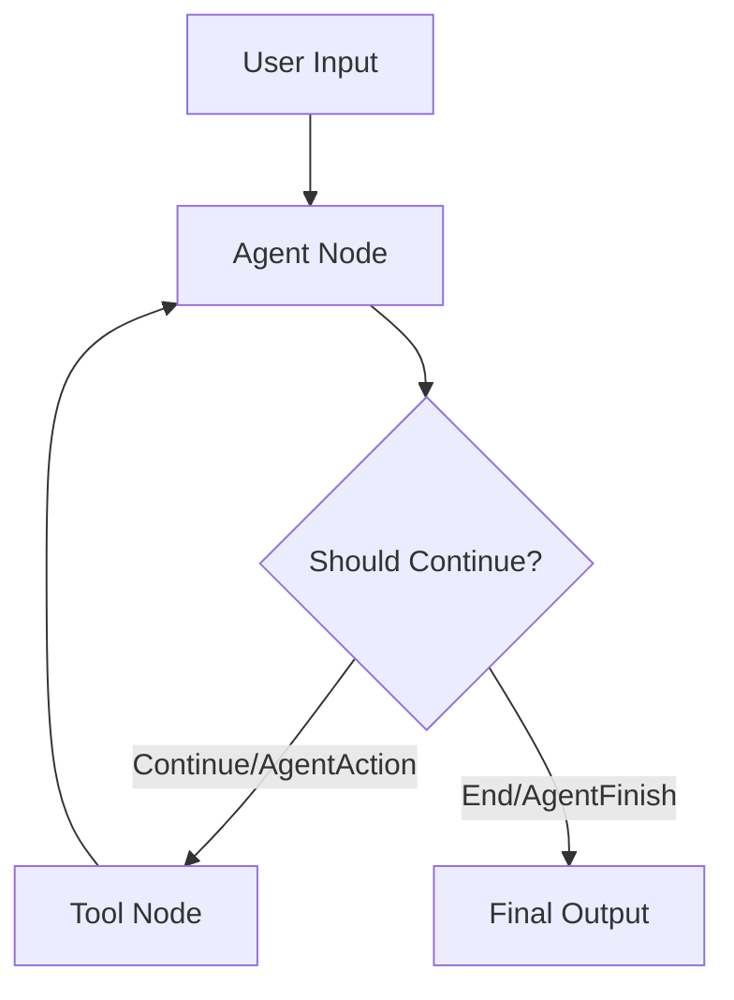
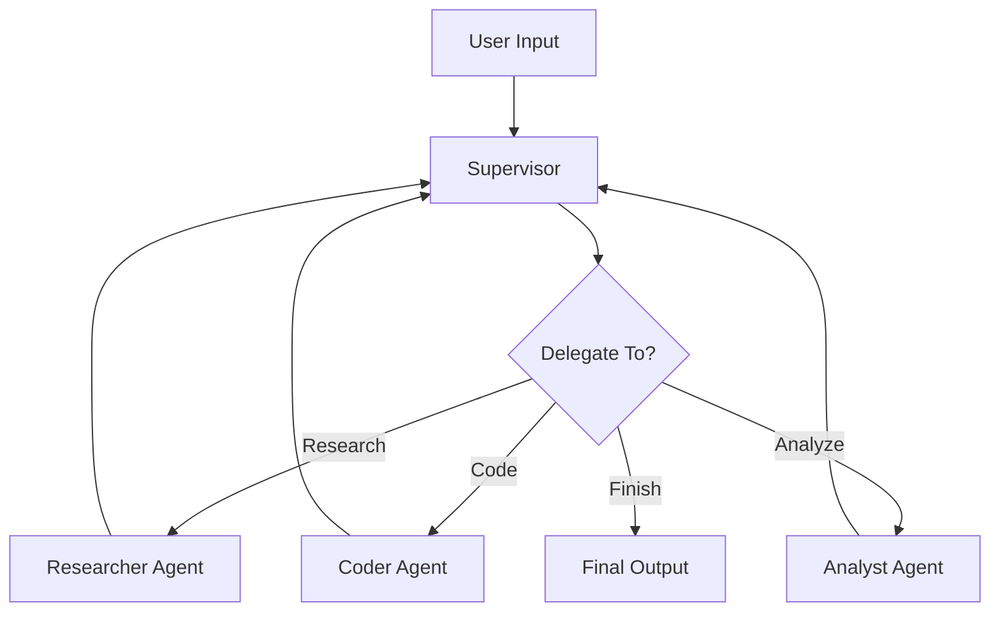
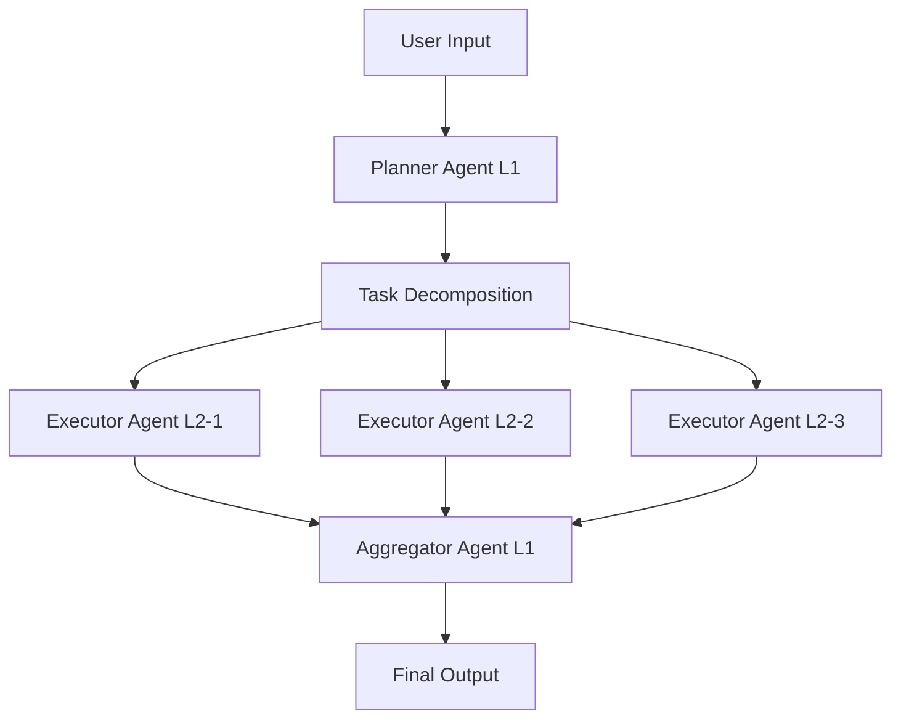
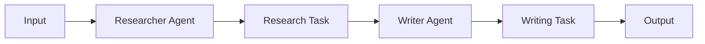
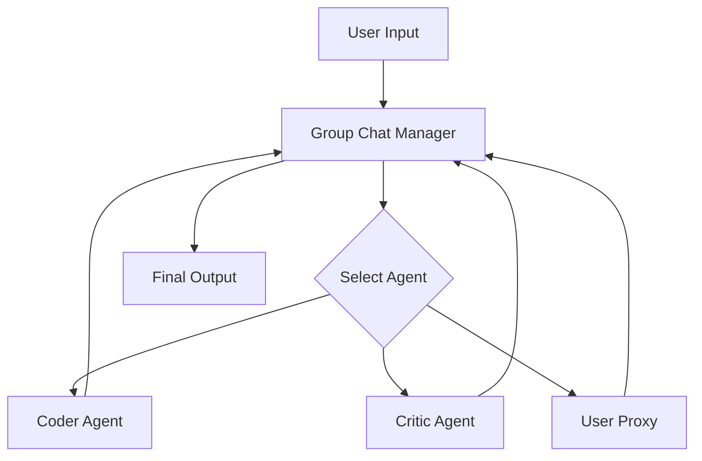

# Pattern Implementations - Planning Architect

**Module Type:** OPTIONAL (Context-Aware Loading)
**Load When:** Designing pattern-specific architectures (LangGraph, CrewAI, AutoGen)
**Version:** 3.0
**Last Updated:** October 16, 2025

## Advanced Pattern-to-Implementation Mapping

This module provides concrete implementation blueprints for common architectural patterns across the three major frameworks: LangGraph, CrewAI, and AutoGen.

---

## LangGraph Implementations

### 1. ReAct Pattern (LangGraph StateGraph)

**Pattern Overview:**
- **Type:** Reasoning + Acting cycle
- **Framework:** LangGraph
- **Use Case:** Agents that need to reason, take actions, observe results, and iterate
- **Complexity:** Simple to Medium

**Implementation Blueprint:**

```python
def design_react_langgraph(analysis):
    """Design ReAct pattern using LangGraph StateGraph"""

    blueprint = {
        'pattern': 'ReAct',
        'framework': 'langgraph',

        'components': [
            {
                'component_type': 'state',
                'name': 'AgentState',
                'structure': {
                    'input': 'str',
                    'agent_outcome': 'Union[AgentAction, AgentFinish]',
                    'intermediate_steps': 'List[Tuple[AgentAction, str]]'
                },
                'design_rationale': 'Tracks reasoning chain and tool execution history'
            },

            {
                'component_type': 'node',
                'name': 'agent_node',
                'function': 'run_agent',
                'responsibilities': [
                    'Execute LLM reasoning',
                    'Decide next action (tool or finish)',
                    'Format tool calls'
                ],
                'implementation': '''
                def run_agent(state):
                    agent_outcome = agent_executor.invoke(state)
                    return {"agent_outcome": agent_outcome}
                '''
            },

            {
                'component_type': 'node',
                'name': 'tool_node',
                'function': 'execute_tools',
                'responsibilities': [
                    'Execute selected tool',
                    'Capture tool output',
                    'Update intermediate steps'
                ],
                'implementation': '''
                def execute_tools(state):
                    tool_result = tools_executor.invoke(state["agent_outcome"])
                    return {"intermediate_steps": [(state["agent_outcome"], tool_result)]}
                '''
            },

            {
                'component_type': 'edge',
                'name': 'router',
                'type': 'conditional',
                'logic': 'Route to tools if AgentAction, finish if AgentFinish',
                'implementation': '''
                def should_continue(state):
                    if isinstance(state["agent_outcome"], AgentFinish):
                        return "end"
                    return "continue"
                '''
            }
        ],

        'graph_construction': '''
        from langgraph.graph import StateGraph, END

        workflow = StateGraph(AgentState)
        workflow.add_node("agent", run_agent)
        workflow.add_node("tools", execute_tools)
        workflow.set_entry_point("agent")
        workflow.add_conditional_edges(
            "agent",
            should_continue,
            {
                "continue": "tools",
                "end": END
            }
        )
        workflow.add_edge("tools", "agent")

        app = workflow.compile()
        '''
    }

    return blueprint
```

**State Schema Design:**

```python
from typing import TypedDict, Union, List, Tuple
from langchain.schema import AgentAction, AgentFinish

class AgentState(TypedDict):
    """State for ReAct pattern"""
    input: str
    agent_outcome: Union[AgentAction, AgentFinish]
    intermediate_steps: List[Tuple[AgentAction, str]]
```

**Architecture Diagram:**



**Best Practices:**
- Use TypedDict for state schema
- Implement clear conditional edges
- Track intermediate steps for debugging
- Include error handling in tool execution
- Add checkpointing for long-running tasks

---

### 2. Supervisor Pattern (Multi-Agent Coordination)

**Pattern Overview:**
- **Type:** Hierarchical multi-agent
- **Framework:** LangGraph
- **Use Case:** Multiple specialized agents coordinated by a supervisor
- **Complexity:** Medium to Complex

**Implementation Blueprint:**

```python
def design_supervisor_langgraph(analysis):
    """Design Supervisor-Worker pattern using LangGraph"""

    blueprint = {
        'pattern': 'Supervisor-Worker',
        'framework': 'langgraph',

        'components': [
            {
                'component_type': 'state',
                'name': 'SupervisorState',
                'structure': {
                    'messages': 'List[BaseMessage]',
                    'next_agent': 'str',
                    'current_task': 'str',
                    'task_results': 'Dict[str, Any]'
                }
            },

            {
                'component_type': 'node',
                'name': 'supervisor_node',
                'function': 'supervisor_agent',
                'responsibilities': [
                    'Analyze incoming task',
                    'Delegate to appropriate worker',
                    'Aggregate worker results',
                    'Decide completion or next step'
                ]
            },

            {
                'component_type': 'node',
                'name': 'researcher_node',
                'function': 'researcher_agent',
                'responsibilities': [
                    'Conduct research tasks',
                    'Gather information',
                    'Synthesize findings'
                ]
            },

            {
                'component_type': 'node',
                'name': 'coder_node',
                'function': 'coder_agent',
                'responsibilities': [
                    'Write code',
                    'Implement solutions',
                    'Test implementations'
                ]
            },

            {
                'component_type': 'edge',
                'name': 'supervisor_router',
                'type': 'conditional',
                'logic': '''
                def router(state) -> str:
                    if state["next_agent"] == "FINISH":
                        return END
                    return state["next_agent"]
                '''
            }
        ],

        'communication_protocol': {
            'message_format': 'BaseMessage (HumanMessage, AIMessage)',
            'coordination': 'Supervisor maintains conversation history',
            'result_aggregation': 'Supervisor combines worker outputs'
        }
    }

    return blueprint
```

**State Schema Design:**

```python
from typing import TypedDict, List, Dict, Any
from langchain.schema import BaseMessage

class SupervisorState(TypedDict):
    """State for Supervisor-Worker pattern"""
    messages: List[BaseMessage]
    next_agent: str
    current_task: str
    task_results: Dict[str, Any]
```

**Architecture Diagram:**



**Best Practices:**
- Supervisor should be stateless (decisions based on current state only)
- Workers should be specialized and independent
- Use message history for context sharing
- Implement clear delegation logic
- Include failure handling for worker errors

---

### 3. Hierarchical Pattern (Multi-Level Task Decomposition)

**Pattern Overview:**
- **Type:** Hierarchical task planning and execution
- **Framework:** LangGraph
- **Use Case:** Complex tasks requiring multi-level decomposition
- **Complexity:** Complex

**State Schema Design:**

```python
from typing import TypedDict, Dict, List, Any

class HierarchicalState(TypedDict):
    """State for Hierarchical pattern"""
    task_hierarchy: Dict[str, Any]
    current_level: int
    level_results: Dict[int, List[Any]]
    aggregation_strategy: str
    coordination_state: Dict[str, Any]
```

**Architecture Diagram:**



**Best Practices:**
- Clear level boundaries and responsibilities
- Aggregation strategy defined upfront
- Each level can have its own agents
- Bottom-up result aggregation
- Top-down task decomposition

---

## CrewAI Implementations

### 1. Sequential Process (Research → Write → Review)

**Pattern Overview:**
- **Type:** Sequential task execution
- **Framework:** CrewAI
- **Use Case:** Tasks with clear sequential dependencies
- **Complexity:** Simple to Medium

**Implementation Blueprint:**

```python
def design_crewai_system(analysis):
    """Design multi-agent system using CrewAI"""

    blueprint = {
        'pattern': analysis.get('pattern', 'Sequential'),
        'framework': 'crewai',

        'components': [
            {
                'component_type': 'agent',
                'name': 'researcher_agent',
                'configuration': {
                    'role': 'Research Specialist',
                    'goal': 'Conduct comprehensive research on topic',
                    'backstory': 'Expert researcher with deep analytical skills',
                    'tools': ['search_tool', 'scrape_tool'],
                    'verbose': True,
                    'memory': True
                }
            },

            {
                'component_type': 'agent',
                'name': 'writer_agent',
                'configuration': {
                    'role': 'Content Writer',
                    'goal': 'Create engaging content based on research',
                    'backstory': 'Professional writer with expertise in technical content',
                    'tools': ['writing_tool'],
                    'verbose': True,
                    'memory': True
                }
            },

            {
                'component_type': 'task',
                'name': 'research_task',
                'configuration': {
                    'description': 'Research {topic} thoroughly',
                    'agent': 'researcher_agent',
                    'expected_output': 'Comprehensive research report'
                }
            },

            {
                'component_type': 'task',
                'name': 'writing_task',
                'configuration': {
                    'description': 'Write article based on research',
                    'agent': 'writer_agent',
                    'expected_output': 'Well-written article',
                    'context': ['research_task']
                }
            },

            {
                'component_type': 'crew',
                'name': 'content_crew',
                'configuration': {
                    'agents': ['researcher_agent', 'writer_agent'],
                    'tasks': ['research_task', 'writing_task'],
                    'process': 'sequential',
                    'verbose': True,
                    'memory': True
                }
            }
        ]
    }

    return blueprint
```

**Architecture Diagram:**



**Best Practices:**
- Define clear roles and goals for each agent
- Use task context for dependencies
- Enable memory for context sharing
- Set expected outputs for validation
- Use process='sequential' for linear workflows

---

### 2. Hierarchical Process (Manager → Workers)

**Pattern Overview:**
- **Type:** Hierarchical delegation
- **Framework:** CrewAI
- **Use Case:** Manager agent delegates and coordinates workers
- **Complexity:** Medium

**Implementation Blueprint:**

```python
{
    'pattern': 'Hierarchical',
    'framework': 'crewai',

    'components': [
        {
            'component_type': 'agent',
            'name': 'manager_agent',
            'configuration': {
                'role': 'Project Manager',
                'goal': 'Coordinate team and ensure project completion',
                'backstory': 'Experienced PM with strong delegation skills',
                'tools': [],
                'verbose': True,
                'memory': True
            }
        },

        {
            'component_type': 'crew',
            'name': 'project_crew',
            'configuration': {
                'agents': ['manager_agent', 'worker1', 'worker2', 'worker3'],
                'tasks': ['task1', 'task2', 'task3'],
                'process': 'hierarchical',
                'manager_llm': 'gpt-4',
                'verbose': True,
                'memory': True
            }
        }
    ]
}
```

**Best Practices:**
- Manager agent should have broader context
- Workers specialized for specific tasks
- Use hierarchical process in Crew
- Manager coordinates and delegates
- Clear task ownership

---

## AutoGen Implementations

### 1. Conversational Pattern (User Proxy + Assistant)

**Pattern Overview:**
- **Type:** Conversational interaction
- **Framework:** AutoGen
- **Use Case:** Back-and-forth dialogue, code generation with execution
- **Complexity:** Simple to Medium

**Implementation Blueprint:**

```python
{
    'pattern': 'Conversational',
    'framework': 'autogen',

    'components': [
        {
            'component_type': 'agent',
            'name': 'user_proxy',
            'configuration': {
                'name': 'user_proxy',
                'human_input_mode': 'NEVER',
                'max_consecutive_auto_reply': 10,
                'code_execution_config': {
                    'work_dir': 'coding',
                    'use_docker': False
                }
            }
        },

        {
            'component_type': 'agent',
            'name': 'assistant',
            'configuration': {
                'name': 'assistant',
                'llm_config': {
                    'model': 'gpt-4',
                    'temperature': 0
                }
            }
        },

        {
            'component_type': 'conversation',
            'interaction_pattern': 'user_proxy.initiate_chat(assistant, message=...)'
        }
    ]
}
```

**Best Practices:**
- UserProxyAgent handles code execution
- AssistantAgent generates solutions
- Set max_consecutive_auto_reply to prevent infinite loops
- Use code_execution_config for safety
- Enable human input mode for critical decisions

---

### 2. Group Chat Pattern (Multiple Agents + Manager)

**Pattern Overview:**
- **Type:** Multi-agent group conversation
- **Framework:** AutoGen
- **Use Case:** Multiple agents collaborating on complex tasks
- **Complexity:** Medium to Complex

**Implementation Blueprint:**

```python
{
    'pattern': 'GroupChat',
    'framework': 'autogen',

    'components': [
        {
            'component_type': 'agent',
            'name': 'user_proxy',
            'type': 'UserProxyAgent'
        },

        {
            'component_type': 'agent',
            'name': 'coder',
            'type': 'AssistantAgent',
            'role': 'Code generation specialist'
        },

        {
            'component_type': 'agent',
            'name': 'critic',
            'type': 'AssistantAgent',
            'role': 'Code review and quality assurance'
        },

        {
            'component_type': 'group_chat',
            'name': 'dev_group',
            'configuration': {
                'agents': ['user_proxy', 'coder', 'critic'],
                'messages': [],
                'max_round': 12
            }
        },

        {
            'component_type': 'manager',
            'name': 'group_manager',
            'configuration': {
                'groupchat': 'dev_group',
                'llm_config': {'model': 'gpt-4'}
            }
        }
    ]
}
```

**Architecture Diagram:**



**Best Practices:**
- Define clear roles for each agent
- Set max_round to prevent infinite conversations
- Manager handles agent selection
- Use speaker_selection_method for custom logic
- Enable message history for context

---

## Hybrid Patterns

### 1. LangGraph + CrewAI Hybrid

**Use Case:** LangGraph orchestration with CrewAI team execution

```python
{
    'pattern': 'Hybrid-LangGraph-CrewAI',
    'orchestration': 'LangGraph StateGraph',
    'execution': 'CrewAI Crew',

    'approach': 'LangGraph manages state and flow, CrewAI executes team tasks'
}
```

### 2. LangGraph + AutoGen Hybrid

**Use Case:** LangGraph workflow with AutoGen conversational agents

```python
{
    'pattern': 'Hybrid-LangGraph-AutoGen',
    'orchestration': 'LangGraph StateGraph',
    'conversation': 'AutoGen GroupChat',

    'approach': 'LangGraph routes to AutoGen conversations for complex dialogues'
}
```

---

## Pattern Selection Guide

| Pattern | Framework | Complexity | Best For | Avoid When |
|---------|-----------|------------|----------|------------|
| ReAct | LangGraph | Simple-Medium | Tool-using agents | Multi-agent coordination |
| Supervisor | LangGraph | Medium | Specialized workers | Simple linear tasks |
| Hierarchical | LangGraph | Complex | Multi-level tasks | Simple workflows |
| Sequential | CrewAI | Simple-Medium | Linear dependencies | Parallel execution needed |
| Hierarchical | CrewAI | Medium | Manager-worker | Peer collaboration |
| Conversational | AutoGen | Simple-Medium | Dialogue, code gen | Pure workflow execution |
| Group Chat | AutoGen | Medium-Complex | Multi-agent collab | Deterministic workflows |

---

**Usage:** Load this module when designing pattern-specific architectures. Reference the appropriate section based on the selected framework and pattern.
